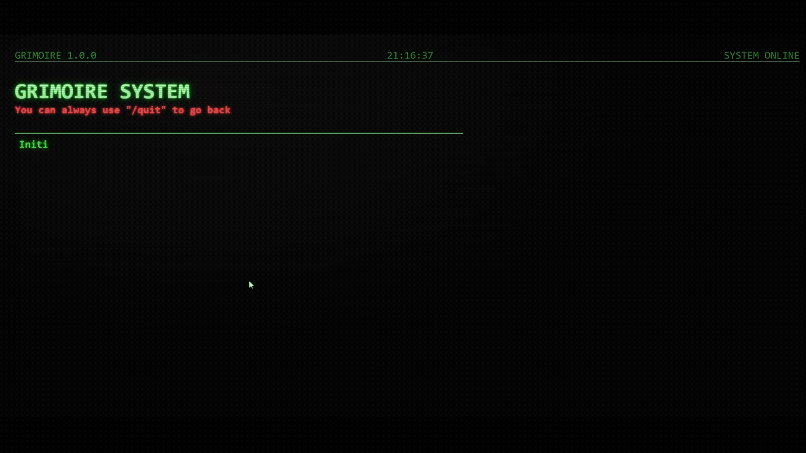
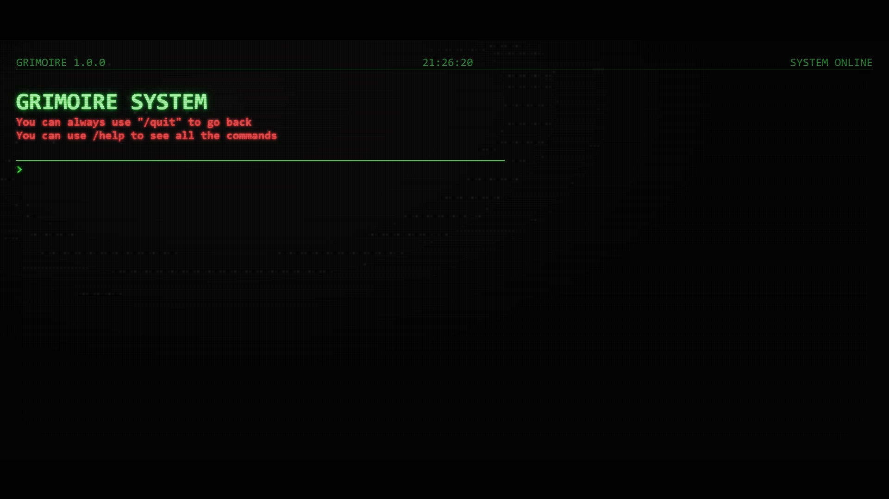

# Grimoire

**Track everything your way, no bureaucracy. Different by design.**

Built as a real-world project to learn Node.js. No tutorials, just building.



Grimoire is a place to save the things you don't want to forget. Books you've read, songs you love, ideas you want to revisit, spells from your favorite game, anything. You decide what goes in, you decide how to label it, and the system stays out of your way.

There are no buttons, no forms, no menus, no drop-downs, no "Are you sure?" pop-ups. You type, the grimoire answers. That's it.

> **Live demo:** https://grimoire-hcj5.onrender.com/

If it takes a while to load, the server may be starting up.

## The idea

Most apps that help you organize things make you pay a tax first. You have to pick from a preset list of fields, toggle switches, fill out five boxes to save one thing. Grimoire flips that around. You get three tiny fields (category, name, tag) and a blank terminal. Everything else is up to you.

Want a list of books? `add books "Dune" classic`. Want to track your workouts? `add workout "leg day" heavy`. Songs? Plants? Passwords for board games? Use whatever categories and tags make sense in your head, and the grimoire will remember them. Then browse them the way you browse thoughts: by category, by tag, by both at once, or all at once.

No setup, no configuration, no tutorial. Just write.

## A UI that feels like a world

The entire app lives inside a single screen built to look and behave like an old terminal, and almost every detail is there to sell that feeling.

### It boots like a real system

When you open Grimoire, it doesn't just appear. It *starts*. The first lines print themselves letter by letter, with that slightly uneven rhythm of an old machine waking up: *"Initializing your Grimoire..."*, *"Getting the rinnegan..."*, *"Loading Mjölnir..."*, *"SUCCESS! MAY THE FORCE BE WITH YOU"*. Only then does the login flow begin. It's a tiny bit of theater, and it immediately tells you what kind of app you just opened.

### The header is alive

At the top of the screen, a little status bar shows `GRIMOIRE 1.0.0`, a clock ticking the current hour in real time, and a `SYSTEM ONLINE` badge. None of it is functional. All of it is there to make the terminal feel inhabited, like a machine someone left running.

### You talk to it, not through it

Every single action is a command you type. Signing in, creating an account, adding an entry, searching, deleting, logging out. The grimoire writes back with its own voice, prefixing successes with `>_ SUCCESS:` and errors with `>_ ERROR:`. There are no toast notifications, no modal dialogs, no icons. Feedback lives in the terminal like everything else.

### A cursor that actually works

One of the things browsers are notoriously bad at is showing a custom caret that behaves well, especially on mobile. Grimoire has its own blinking block cursor that follows your typing pixel by pixel, measuring each character so it lands exactly where the next letter will appear. It works with backspace, with selection, with the virtual keyboard on a phone. It feels small, but it's the difference between "a webpage pretending to be a terminal" and "a terminal that happens to live on the web".

### Waiting is part of the show

When the grimoire is fetching something, it doesn't hide behind a spinner. It prints a line, *"Searching all the registries..."*, and the dots animate at the end. You watch the system work.



### Results read like a printout

Your entries come back one line at a time, each typed in with the same typewriter effect the rest of the app uses. A list of ten books doesn't pop onto the screen, it unfolds. The whole interface leans into the idea that the grimoire is writing for you, not rendering to you.

### A system with opinions

Grimoire notices when you make mistakes. Type something it doesn't understand, and it gently suggests `help`. Type another wrong command, and the tone shifts a little. Keep going, and it gets progressively more dramatic: amused, tired, openly judgmental, finally almost theatrical. There are six escalating tiers of reaction with several variations each, picked at random, so messing up is never exactly the same experience twice. It's one of the places where the grimoire stops being a tool and becomes a character.

### An escape hatch everywhere

In the middle of any flow, at any prompt, typing `/quit` takes you back to the start. Grimoire never traps you inside a form you can't exit.

## The commands

```
list                              list everything
listByCategory <category>         filter by category
listByTag <tag>                   filter by tag
list <category> <tag>             filter by both
add <category> "<name>" <tag>     add an entry
remove <category> "<name>" <tag>  remove an entry
categories                        list every category you've created
help                              show this menu
clear                             wipe the terminal
logout                            leave your grimoire
```

## Accounts

Every grimoire belongs to one person. On your first visit you pick `[1] enter grimoire` to sign in or `[2] create grimoire` to make a new account. Emails and passwords are checked as you type, with terminal-style feedback if something is off. Sessions are remembered across visits, so your grimoire is waiting the next time you come back.

## Tech behind it

The back end is Node.js with Express, talking to a Supabase database. Passwords are hashed, tokens are signed, and the sensitive routes are rate-limited so the system stays calm under pressure. The front end is plain HTML, CSS and JavaScript with no framework: the terminal, the caret, the typewriter effect, the command parser and the escalating error messages are all handwritten.

## Running it locally

```bash
npm install
npm start
```

By default the server starts on port 3000. To connect it to your own Supabase project, create a `.env` file in the root with:

```
SUPABASE_URL=...
SUPABASE_KEY=...
JWT_SECRET=...
```

The database schema is in [sql_supabase.sql](sql_supabase.sql).

---

*Tip: if you ever get lost, just type `help`. Or `/quit`.*
